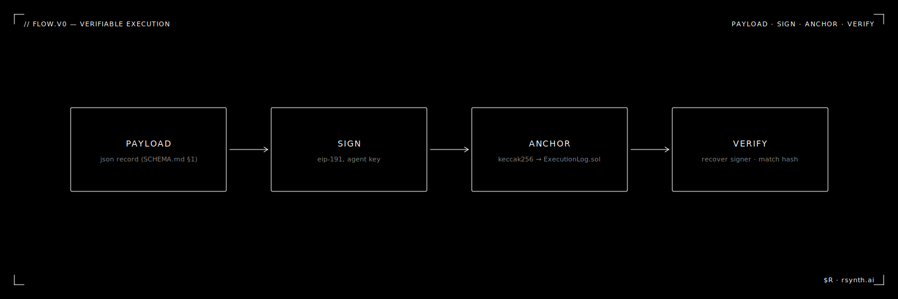

# sdk

verifiable robot execution.

sign. anchor. verify.



a robot performs an action. the payload — task, duration, metrics, outcome — is signed and its hash is anchored on base. anyone can verify a posted execution matches its on-chain record.

intelligence layer for the robotics economy. `$R`.

---

## status

early. scaffolding. interfaces in place, implementation in progress.

## structure

- `sdk/` — python client. sign payloads, anchor hashes, verify.
- `contracts/` — solidity (foundry). on-chain execution log.
- `examples/` — integrations. first target: lerobot eval pipelines.

see [`SCHEMA.md`](./SCHEMA.md) for the payload format and verification flow.

## install

```bash
# python sdk (dev install, pre-release)
cd sdk
pip install -e .
```

```bash
# contracts
cd contracts
forge build
forge test
```

## links

- [rsynth.ai](https://rsynth.ai)
- `$R` on base · [`0x9CC8C9C88ba07Ce24D54597E174C4127C7995757`](https://basescan.org/token/0x9CC8C9C88ba07Ce24D54597E174C4127C7995757)
- erc-8004 agent · `#10311`
- [@ResearchSynth](https://x.com/ResearchSynth)

## license

MIT.
